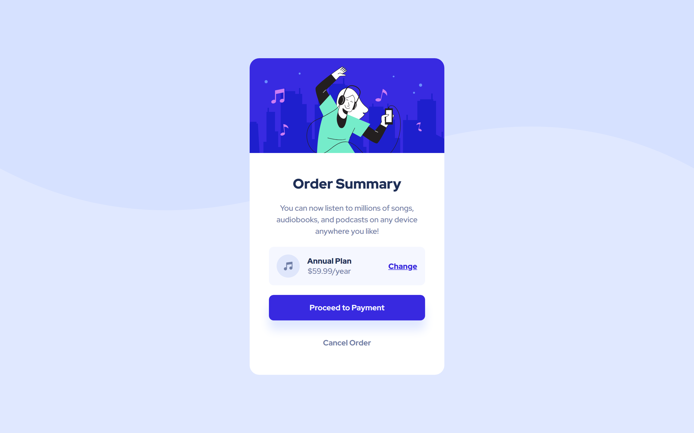

# Frontend Mentor - Order summary card solution

This is a solution to the [Order summary card challenge on Frontend Mentor](https://www.frontendmentor.io/challenges/order-summary-component-QlPmajDUj). Frontend Mentor challenges help you improve your coding skills by building realistic projects. 

## Table of contents

- [Overview](#overview)
  - [The challenge](#the-challenge)
  - [Screenshot](#screenshot)
  - [Links](#links)
- [My process](#my-process)
  - [Built with](#built-with)
  - [What I learned](#what-i-learned)
  - [Continued development](#continued-development)
- [Author](#author)

## Overview
A Project that builds more confidence in the layout skills of CSS Grid and Flexbox and spacing utilities. 

trying to align different elements with different styles across the card component.

### The challenge

Users should be able to:

- See hover states for interactive elements

### Screenshot

#### Mobile

#### Desktop

### Links

- Solution URL: [Solution URL](https://www.frontendmentor.io/solutions/mobilefirst-approach-using-css-grid-and-flexbox-aTUQRMudk9)
- Live Site URL: [Live Site URL](https://frontendmentor-ilyesab.github.io/order-summary-component/)

## My process

### Built with

- Semantic HTML5 markup
- CSS custom properties
- Flexbox
- CSS Grid
- Mobile-first workflow

### What I learned

There was nothing new in this project it's similar to the other projects that are part of the **Getting Started on Fronted Mentor roadmap.**

However it helps to solidify the layout/spacing skills used frequently when designing web pages.

### Continued development
Getting more practice in regards to simple layouts before moving to more complex/responsive ones.

## Author

- Frontend Mentor - [@ilyesab](https://www.frontendmentor.io/profile/ilyesab)
